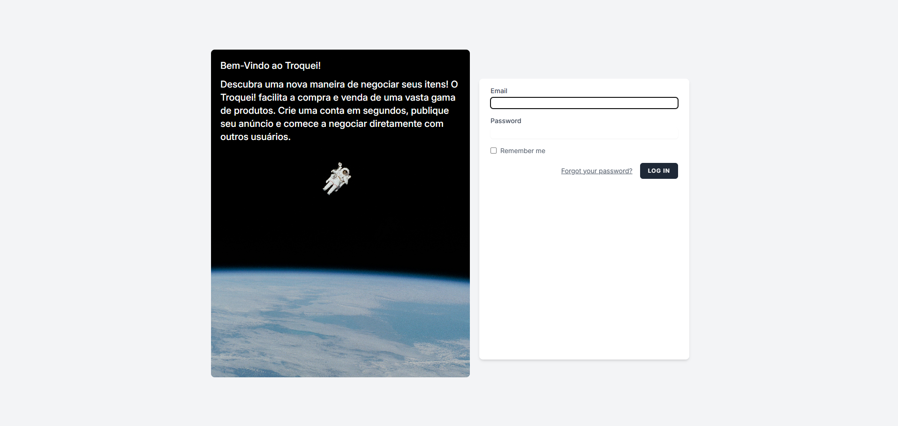
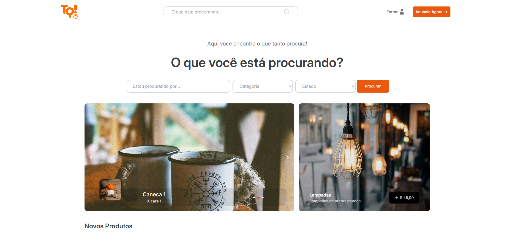
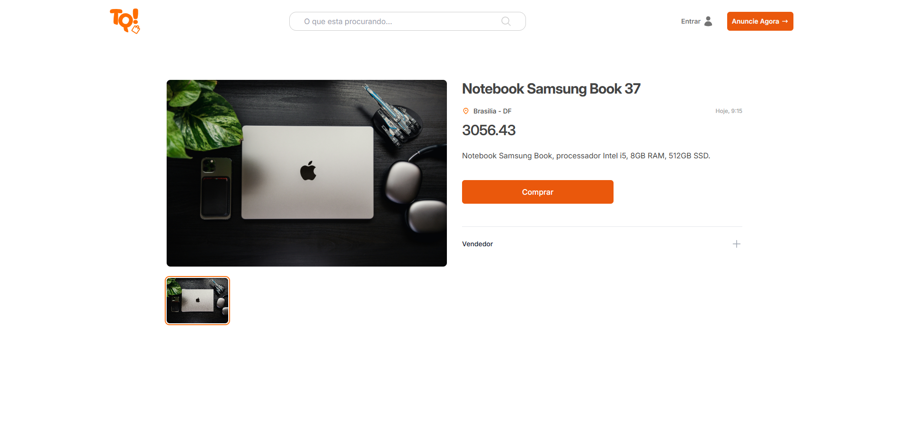

# Troquei

**Troquei** é uma plataforma inspirada na economia colaborativa, focada na **troca de objetos entre usuários**. Ao invés de comprar e vender como na OLX, aqui as pessoas **negociam trocas diretamente**, promovendo o consumo consciente e sustentável.

## ✨ Visão Geral

O objetivo do Troquei é oferecer uma alternativa gratuita e prática para que usuários possam anunciar produtos usados que não utilizam mais, encontrar objetos de interesse e **negociar trocas com outras pessoas**.

## 🚀 Funcionalidades

- Publicação de anúncios com imagens, categorias e descrições  
- Busca e filtragem de itens disponíveis para troca  
- Sistema de mensagens privadas para negociação entre usuários  

## 🖼️ Capturas de Tela

### Tela de Login


### Página Inicial


### Página do Produto


## 🛠️ Tecnologias Utilizadas

- **Frontend:** HTML, CSS, JavaScript, Vue.js  
- **Backend:** PHP, Laravel  
- **Banco de Dados:** MySQL  

## 📦 Como Rodar o Projeto

1. Clone o repositório:
   ```bash
   git clone https://github.com/MarcoAntonioRochaNunes/Troquei.git
   
2. Instale as dependências do backend (Laravel):
   ```bash
   composer install
   
3. Configure o ambiente:
   
   Copie o arquivo .env.example para .env

   Configure as variáveis de ambiente (banco de dados, etc.)

   Gere a chave da aplicação:
   ```bash
   php artisan key:generate

5. Execute as migrações:
   ```bash
   php artisan migrate

6. Inicie o servidor de desenvolvimento Laravel:
   ```bash
   php artisan serve
Acesse via navegador: http://127.0.0.1:8000

6. Em outro terminal, inicie o build do frontend:
   ```bash
   npm install
   npm run dev
